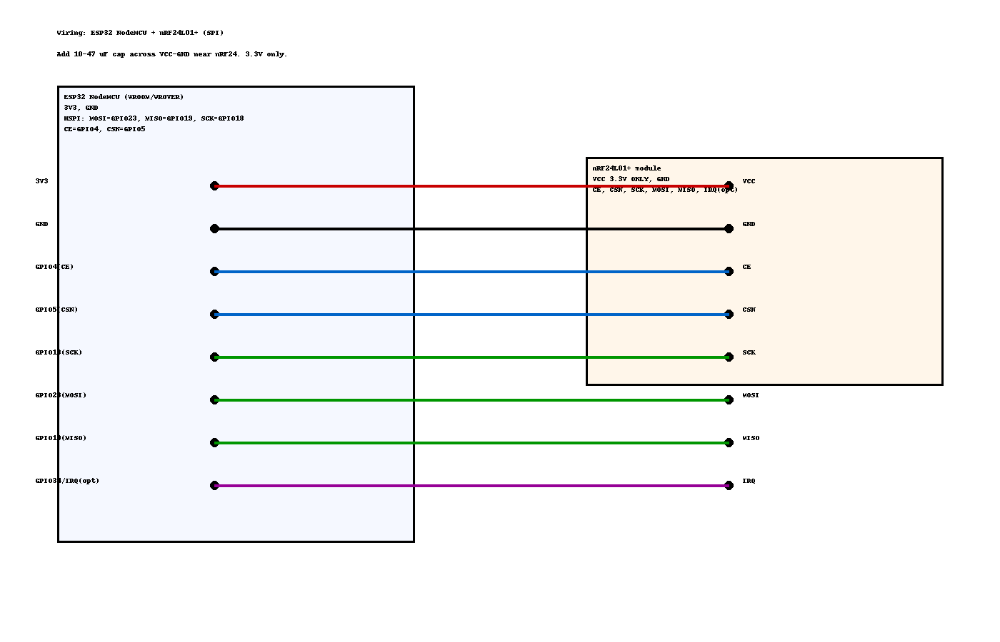
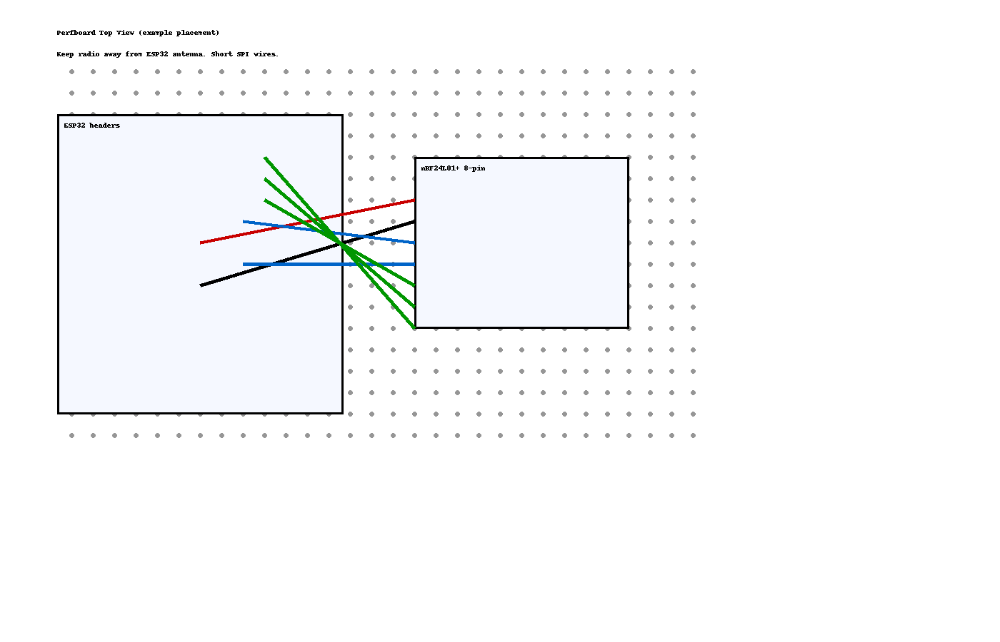

# Plant Disease Monitoring — All-in-One README

> ครบชุด: เซิร์ฟเวอร์ FastAPI (TFLite/Heuristic) + ESP32-CAM (อัปโหลดภาพ) + โหนดเซนเซอร์ nRF24 + เกตเวย์ nRF24 → HTTP พร้อมแผนผังสายและเลย์เอาต์ลงแผ่นรูโปรโต

---

## โครงสร้างระบบ (Topology)
```
[ESP32-CAM] --Wi‑Fi--> [FastAPI Server] --> JSON (label, score, healthy)
[ESP32 Sensor Node + nRF24] --RF24--> [ESP32 Gateway] --HTTP--> [Server /predict_values]
```

---

## รูปผังสายและเลย์เอาต์ (คลิกเพื่อขยาย)
### การต่อ ESP32 NodeMCU ↔ nRF24L01+


### ตัวอย่างการจัดวางบนแผ่นรูโปรโต (Perfboard Top View)


> เคล็ดลับ: เติมคาปาซิเตอร์ 10–47 µF คร่อม VCC–GND ใกล้โมดูล **nRF24L01+** ใช้ไฟ **3.3V เท่านั้น** และเดินสาย SPI ให้สั้นที่สุด

---

## การติดตั้งเซิร์ฟเวอร์ (FastAPI)
รองรับ 2 โหมด
- **TFLite mode**: มี `app/model.tflite` + `app/labels.txt` → จำแนกโรคพืชจริง
- **Heuristic mode**: ไม่มีโมเดล → วิเคราะห์ความเขียวของใบเพื่อเดาคร่าว ๆ

```bash
python -m venv venv
# Windows: venv\Scripts\activate
# macOS/Linux: source venv/bin/activate

# โหมดเบา (แนะนำเครื่องธรรมดา)
pip install -r requirements-tflite-runtime.txt

# หรือใช้ TensorFlow CPU เต็ม
# pip install -r requirements-tf.txt

uvicorn app.server:app --host 0.0.0.0 --port 8000
# เปิดเอกสาร API: http://<SERVER_IP>:8000/docs
```

> โฟลเดอร์สำคัญ:  
> `app/server.py` — API `/predict` (รูปภาพ), `/predict_values` (ค่าจากเซนเซอร์)  
> `app/alerts/` — ระบบจะบันทึกรูปที่ประเมินว่าไม่ healthy พร้อมเมทาดาทา

---

## ฝั่งอุปกรณ์ (Devices)

### 1) ESP32‑CAM (AI Thinker) — ส่งภาพเข้า `/predict`
ไฟล์: `esp32cam_ai_client/esp32cam_ai_client.ino`
- กำหนด `WIFI_SSID`, `WIFI_PASS`, `SERVER_IP`
- บอร์ด: **AI Thinker ESP32-CAM**
- อัปโหลด (GPIO0 → GND เพื่อเข้าโหมดแฟลช) แล้วกดรีเซ็ต
- เปิด Serial Monitor จะเห็น JSON ที่ตอบกลับจากเซิร์ฟเวอร์

ปรับความเร็ว/ขนาดไฟล์:  
- ลด `frame_size` เป็น `QVGA`/`CIF` หรือเพิ่ม `jpeg_quality` ให้ไฟล์เล็กลง → ส่งเร็วขึ้น

### 2) Sensor Node (ESP32 NodeMCU + nRF24) — ส่งข้อมูลผ่าน RF24
ไฟล์: `esp32_nrf24_sensor_node/esp32_nrf24_sensor_node.ino`
- ต่อสายตามรูปใน `assets/esp32_nrf24_wiring.png`  
  - SCK=GPIO18, MOSI=GPIO23, MISO=GPIO19, CE=GPIO4, CSN=GPIO5, (IRQ=GPIO34 ไม่บังคับ)  
- เปลี่ยนค่าจำลองเป็นการอ่านเซนเซอร์จริง (DHT, Soil moisture ฯลฯ)
- ปรับ `radio.setChannel()`/`setDataRate()` หากมีสัญญาณรบกวน

### 3) Gateway (ESP32 + nRF24) — รับ RF24 แล้วส่ง HTTP → `/predict_values`
ไฟล์: `esp32_nrf24_gateway_http/esp32_nrf24_gateway_http.ino`
- กำหนด `WIFI_SSID`, `WIFI_PASS`, `SERVER_URL`
- เปิด Serial Monitor เพื่อดูการ POST และผลลัพธ์จากเซิร์ฟเวอร์

> คำแนะนำ RF24:  
> - DataRate: `RF24_250KBPS` (ไกล/ทนสัญญาณรบกวนดีที่สุด), `RF24_1MBPS` (สมดุล), `RF24_2MBPS` (เร็วสุดระยะสั้น)  
> - เพิ่มคาปาใกล้โมดูล, ใช้สายสั้น, จัดวางโมดูลให้ห่างเสาอากาศของ ESP32

---

## จุดตั้งค่า (สำคัญ)

| จุด | ไฟล์ | ค่าที่ต้องตั้ง |
|---|---|---|
| Server IP/Port | เซิร์ฟเวอร์ | `uvicorn app.server:app --host 0.0.0.0 --port 8000` |
| Wi‑Fi | ESP32-CAM / Gateway | `WIFI_SSID`, `WIFI_PASS` |
| API URL | Gateway | `SERVER_URL` = `http://<SERVER_IP>:8000/predict_values` |
| โมเดล TFLite | เซิร์ฟเวอร์ | วาง `app/model.tflite` + ปรับ `app/labels.txt` |
| พรีโพรเซส | เซิร์ฟเวอร์ | ฟังก์ชัน `preprocess_img_tflite()` ให้ตรง pipeline โมเดล |

---

## การทดสอบ End-to-End
1. รันเซิร์ฟเวอร์ → เปิด `http://<SERVER_IP>:8000/docs` ตรวจ endpoint  
2. เปิด ESP32‑CAM → ดูผล JSON จาก `/predict` บน Serial  
3. เปิด Sensor Node + Gateway → ดู JSON จาก `/predict_values` บน Serial ของ Gateway  
4. ตรวจ `app/alerts/` หากมีรูปไม่ healthy จะถูกบันทึกไว้

---

## Troubleshooting สั้น ๆ
- **nRF24 ส่งไม่ติด/รีเซ็ตบ่อย** → เติมคาปา 10–47µF, ใช้ 3.3V ที่นิ่ง, สายสั้น, เปลี่ยนช่อง/อัตราเรต
- **ESP32‑CAM ช้า/หน่วง** → ลดความละเอียด/เพิ่ม JPEG quality (เลขมากขึ้น = บีบอัดมากขึ้น = ไฟล์เล็กลง)
- **HTTP Timeout** → เช็ค IP/ไฟร์วอลล์/พอร์ต, เพิ่ม timeout ฝั่ง ESP32
- **โมเดลผิดผล** → ตรวจ `labels.txt`, ปรับ preprocessing ให้ตรงกับตอนเทรน

---

## License & Credits
- คุณสามารถนำไปปรับใช้/ดัดแปลงได้ตามต้องการเพื่อการเรียนรู้และต้นแบบ
- ขอบคุณชุมชน ESP32, RF24 และ FastAPI
